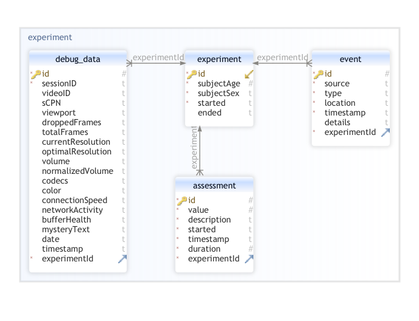

# Manual

This repository consists of Chrome extension and REST API application (backend). Both are using Node and Javascript.

# Extension

<b>1. After cloning the repository:</b>

- `cd` into the `./extension` directory and run `npm install` to install required dependencies,
  <b>2. To install the extension</b>
- `cd` into the `./extension` directory,
- run `npm run build` to create extension build,
- go to Chrome Web Browser, expand context menu by clicking the 🧩 `Puzzle Icon` and select ⚙️ `Manage Extensions` at the bottom,
- make sure the `Developer Mode` is <b>enabled</b>,
- click `Load Unpacked` and load the <b>build</b> directory generated as a result of `npm run build` command

<b>2. To run the extension</b>

- go to Chrome Web Browser and click _YouTube QoExtension_ popup icon
- fill the required information on subject and start experiment

<b>Backend application must be up and running to start the extension application correctly.</b>

# Extension Settings

It is possible to configure settings the experiment will be run with. There is no dedicated UI for manipulating the settings as after each extension reload the settings are set to default values.
One can change the experiment settings by accessing the `extension/src/utils/storage/index.ts` file and configuring the following constant:

```typescript
export const ExperimentSettingsDefault: ExperimentSettings = {
  experimentDurationMs: 40 * 1e3 * 60,
  bitrateScenario: [200e3, 250e3, 500e3, 750e3, 800e3, 900e3], // bps
  bitrateIntervalMs: 15e3, // time between network throttling changes
  assessmentTimeoutMs: 30e3, // time before next assessment panel shows up, jitter is applied to it
  assessmentRetryTimeoutMs: 10e3, // retry time if the assessment was opened outside of the video
  assessmentQuestion: 'Proszę ocenić jakość serwisu od strony audio-wizualnej', // text visible on the assessment panel
  assessmentJitterRangeMs: [5000, 20000], // range of jitter in ms

  useJitter: true, // enable/disable jitter
  useAssessments: true, // enable/disable assessments
}
```

<b>NOTE</b>
For any change to take place it is required to re-build the extension by running `npm run build` inside the `extension` directory. After building one must reload the extension in the Chrome browser's extensions menu.

# Backend

<b>1. After cloning the repository:</b>

- `cd` into the `./backend` directory and run `npm install` to install required dependencies

<b>2. To install the backend application:</b>

- `cd` into `./backend` directory,
- run `npm install` to install required dependencies,
- run `npm run build` to create project build,
- `cd` into the `./backend/build` directory - this directory contains Javascript files ready to be executed by Node environment,
- run `npx typeorm schema:sync -d ./database/index.js` in order to create the SQLite database file and synchronize it with Entities

<b>To start the backend application</b>

- `cd` into `./backend/build` and run `node index.js`

# Database structure



The event table holds information on events occuring during the experiment:

- source - describes the origin of the event, several are available
  - network - network event, _throttling_ etc.
  - player - video player events, _pause_, _seeking_, _buffering_ etc.
  - subject - subject induced events, _mousemove_, _mousedrag_, _keydown_
- type - describes detailed type of the event eg. _mousemove_, _buffering_, etc. See the source property above.
- timestamp: datetime moment of the event
- location: URL location the event ocurred
- experimentID: foreing key, pointing to the experiment during which event ocurred
- details: JSON string containing object with key-value pairs different for each event <b>type</b>

# List of all event <b>types</b>:

- mousedown (subject) - subject clicked left mouse button
- mouseup (subject) - subject released left mouse button
- mousedrag (subject) - subject moved mouse while pressing left mouse button
- scroll (subject) - subject scrolled
- keydown (subject) - subject pressed keyboard key
- keyup (subject) - subject released keyboard key
- throttle (network) - extension executed network throttling
- buffering (player) - video player is buffering content
- seeking (player) - video player started seeking to pointed position
- seeked (player) - video player seeked to pointed position
- paused (player) - video player was paused
- playing (player) - video player was resumed

Continuous events, such as _buffering_ and _mosuedrag_ are recorded by the software at time intervals. In the case of _mousedrag_ this interval is indeterminate as it is dependend on platform, browser, system etc; whereas the _buffering_ interval is defined in source code.

For example the _buffering_ event is send to the server at defined intervals as long as the buffering occurs. In contrary to that the _seeking_ and _seeked_ events are send only once in the beginning of the seeking and at the end.

Exemplary log related to video seeking:
`seeking, buffering, buffering, buffering, ..., buffering, seeked`.
